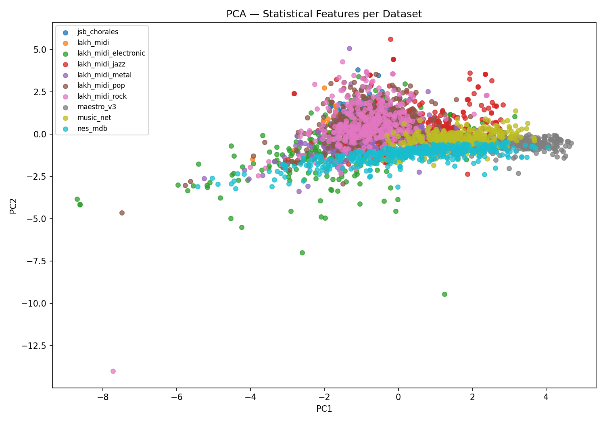
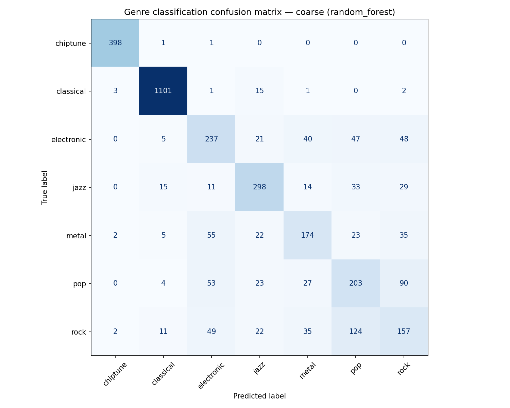
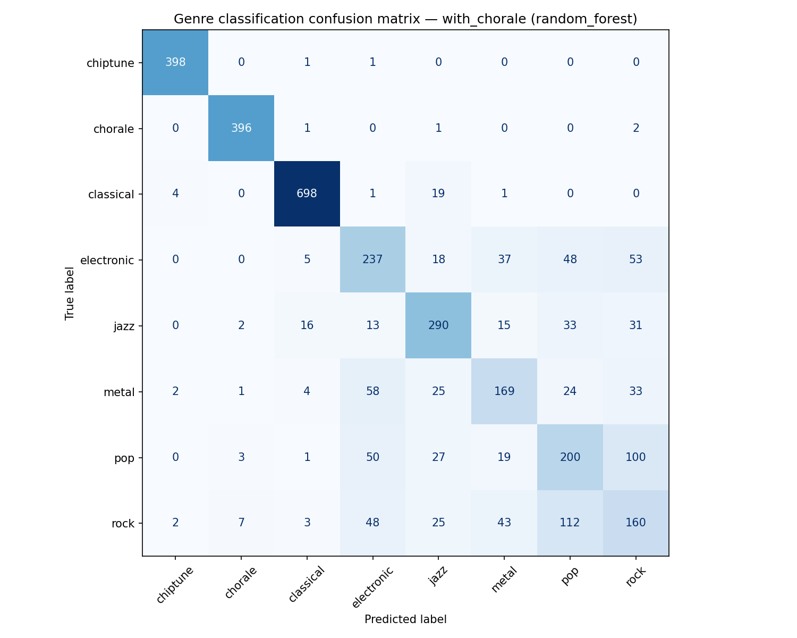

# Analiza datasetów — ocena sensowności i separowalności

## 0. Odsłuch datasetów — subiektywna ocena ekspercka

Przed uruchomieniem metryk numerycznych przesłuchaliśmy próbki z datasetów, aby
ocenić ich charakter muzyczny i sprawdzić, czy oczekiwane relacje podobieństwa
mają sens także z perspektywy słuchacza. Ten etap jest ważny, bo pozwala
zinterpretować wyniki algorytmów w odniesieniu do realnie słyszalnych różnic.

| Dataset | Co słyszymy | Oczekiwane podobieństwo |
|---|---|---|
| **maestro_v3** | Wirtuozowska muzyka fortepianowa, szeroki rejestr, duża zmienność faktury i wyraźna tonalność. | Bliskie `music_net`, dalekie od `nes_mdb`. |
| **music_net** | Muzyka klasyczna i kameralna, często wielogłosowa, o podobnym języku harmonicznym do MAESTRO. | Bliskie `maestro_v3`, umiarkowanie bliskie `jsb_chorales`. |
| **jsb_chorales** | Czterogłosowe chorały Bacha: regularne, homogeniczne, z czytelną harmonią i dość wąskim zakresem rejestrowym. | Umiarkowanie podobne do klasyki, ale specyficzne względem MAESTRO przez chorałową fakturę. |
| **nes_mdb** | Muzyka 8-bit/chiptune: ograniczona polifonia, bardzo regularna rytmika, prostsze barwy i repetytywne wzorce. | Dalekie od klasyki i większości Lakh MIDI. |
| **lakh_midi_rock / metal / pop / jazz / electronic** | Wielościeżkowe MIDI z muzyki popularnej, często z perkusją i akompaniamentem; duże zróżnicowanie wewnątrzgatunkowe. | Gatunki Lakh MIDI powinny być relatywnie bliskie sobie, szczególnie pop/rock/metal. |

Wnioski z odsłuchu: Datasety różnią się w sposób natychmiast słyszalny:
`nes_mdb` jest łatwo rozpoznawalny przez chiptune'owy charakter i regularność,
a `jsb_chorales` przez chorałową, czterogłosową fakturę. Gatunki Lakh MIDI są
trudniejsze do jednoznacznego rozróżnienia między sobą, co powinno skutkować
częściowym nakładaniem się klastrów i umiarkowaną, a nie perfekcyjną,
skutecznością klasyfikacji.

## 1. Wstępna ocena datasetów

| Dataset | n_files | mean_polyphony | mean_pitch_entropy | mean_pitch_range | mean_groove_consistency |
|---------|--------:|---------------:|-------------------:|-----------------:|------------------------:|
| jsb_chorales | 400 | 4.008 | 4.295 | 35.450 | 0.872 |
| lakh_midi | 30 | 5.013 | 3.961 | 51.333 | 0.952 |
| lakh_midi_electronic | 398 | 3.919 | 3.751 | 52.947 | 0.960 |
| lakh_midi_jazz | 400 | 4.245 | 4.575 | 54.225 | 0.953 |
| lakh_midi_metal | 316 | 4.027 | 4.123 | 49.778 | 0.964 |
| lakh_midi_pop | 400 | 5.392 | 4.171 | 54.170 | 0.947 |
| lakh_midi_rock | 400 | 5.187 | 4.183 | 52.133 | 0.946 |
| maestro_v3 | 400 | 2.439 | 5.382 | 68.335 | 0.976 |
| music_net | 323 | 3.140 | 5.075 | 56.969 | 0.977 |
| nes_mdb | 400 | 2.212 | 4.144 | 51.460 | 0.999 |

Wnioski: Datasety różnią się w sposób muzycznie sensowny: `maestro_v3` ma najwyższy średni zakres wysokości dźwięków i wysoką entropię wysokości, co pasuje do repertuaru fortepianowego. `nes_mdb` ma najniższą polifonię i bardzo wysoką groove consistency, co odpowiada bardziej regularnej, sekwencyjnej muzyce chiptune. `jsb_chorales` wyróżnia się stabilną, około czterogłosową fakturą i niższym zakresem wysokości, zgodnym z chorałami.

## 2. Separowalność klas — PCA

Wnioski: PCA pokazuje częściową separowalność: `maestro_v3`, `music_net` i `nes_mdb` układają się w bardziej zwarte pasma po prawej stronie wykresu, podczas gdy gatunki Lakh MIDI mocniej nachodzą na siebie. Największe nakładanie widać między `lakh_midi_pop`, `lakh_midi_rock`, `lakh_midi_metal` i `lakh_midi_jazz`, co jest oczekiwane, bo są to bliskie stylistycznie podzbiory tego samego źródła. Oznacza to, że proste cechy statystyczne niosą sygnał separujący datasety, ale nie zastępują w pełni metryk porównujących rozkłady i embeddingi.

## 3. Baseline klasyfikator

| Model | Accuracy (5-fold CV) |
|-------|----------------------|
| KNN (k=3) | 61.5% ± 1.4% |
| Random Forest | 72.1% ± 1.7% |

Najważniejsze cechy (Random Forest):

| Cecha | Importance |
|-------|-----------:|
| groove_consistency | 0.2336 |
| polyphony | 0.1762 |
| pitch_class_entropy | 0.1480 |
| pitch_entropy | 0.1411 |
| pitch_range | 0.1341 |

Wnioski: Wynik KNN jest umiarkowany, co sugeruje, że lokalne sąsiedztwo w prostej przestrzeni cech nie rozdziela idealnie wszystkich datasetów. Random Forest osiąga 72.1%, więc cechy statystyczne mają wyraźny sygnał klasyfikacyjny, ale separowalność nie jest na tyle wysoka, żeby traktować je jako pełny zamiennik FMD. Najważniejsze cechy wskazują, że rytmiczna regularność, polifonia i rozkład wysokości są głównymi źródłami różnic między datasetami.

## 4. Klasyfikacja gatunku / stylu muzycznego

Oprócz klasyfikacji konkretnego datasetu przeprowadzono drugi eksperyment:
klasyfikację stylu muzycznego na podstawie tych samych cech per utwór MIDI. W
tym eksperymencie `lakh_midi` bez doprecyzowanego gatunku został pominięty,
ponieważ jest zbiorem mieszanym i nie ma jednoznacznej etykiety stylu.

| Dataset | Etykieta coarse | Etykieta with_chorale |
|---|---|---|
| maestro_v3 | classical | classical |
| music_net | classical | classical |
| jsb_chorales | classical | chorale |
| nes_mdb | chiptune | chiptune |
| lakh_midi_electronic | electronic | electronic |
| lakh_midi_jazz | jazz | jazz |
| lakh_midi_metal | metal | metal |
| lakh_midi_pop | pop | pop |
| lakh_midi_rock | rock | rock |

| Wariant | KNN (k=3) | SVM (RBF) | Random Forest |
|---|---:|---:|---:|
| coarse | 64.5% ± 1.3% | 69.4% ± 1.0% | **74.7% ± 1.6%** |
| with_chorale | 64.5% ± 1.5% | 69.2% ± 1.0% | **74.1% ± 1.7%** |

Wnioski: Random Forest ponownie wypada najlepiej, osiągając około 74% accuracy,
czyli nieco więcej niż klasyfikacja konkretnego datasetu. Klasy `chiptune`,
`classical` i osobno wydzielone `chorale` są rozpoznawane bardzo dobrze, co
zgadza się z odsłuchem: NES-MDB i chorały Bacha mają bardzo charakterystyczny
profil. Największe pomyłki występują między stylami popularnymi z Lakh MIDI,
zwłaszcza `rock`, `pop`, `metal` i `electronic`, co jest muzycznie sensowne,
bo są to wielościeżkowe MIDI o podobnym instrumentarium i dużej zmienności
wewnątrzgatunkowej.

Metryki JSD, Wasserstein i FMD nie zostały użyte bezpośrednio jako cechy SVM,
ponieważ są dystansami między datasetami, a nie cechami pojedynczego utworu.
Klasyfikator stylu działa więc na cechach per-file, natomiast metryki złożone
służą do porównywania całych zbiorów.

## 5. Korelacja Spearmana względem FMD

| Metryka | ρ | p-value |
|---------|--:|--------:|
| jsd_interval | 0.829 | 0.042 |
| interval_wasserstein | 0.829 | 0.042 |
| average_wasserstein | 0.829 | 0.042 |
| length_note_wasserstein | 0.771 | 0.072 |
| jsd_pitch_class | 0.600 | 0.208 |
| pitch_class_wasserstein | 0.429 | 0.397 |

Wnioski: Najlepiej z FMD korelują metryki interwałowe, co sugeruje, że relacje
melodyczno-harmoniczne są ważniejsze dla globalnego podobieństwa datasetów niż
sam rozkład klas wysokości. `jsd_pitch_class` ma umiarkowane ρ = 0.600, ale
p-value = 0.208, więc nie jest istotny statystycznie na tej próbie. Trzeba też
pamiętać, że korelacja została policzona tylko dla 6 par datasetów, więc ma
charakter ilustracyjny: pojedyncza nietypowa para może mocno zmienić ranking i
p-value.

## 6. Wniosek końcowy

Proste cechy statystyczne sensownie różnicują datasety: PCA pokazuje widoczne
pasma dla `maestro_v3`, `music_net` i `nes_mdb`, a Random Forest osiąga 72.1% ±
1.7% accuracy przy 5-krotnej walidacji krzyżowej. Jednocześnie KNN na poziomie
61.5% ± 1.4% oraz nakładanie się podzbiorów Lakh MIDI pokazują, że ta
reprezentacja nie separuje wszystkich stylów jednoznacznie. Klasyfikator
gatunku/stylu wzmacnia ten wniosek: Random Forest osiąga 74.7% ± 1.6% w
wariancie coarse i 74.1% ± 1.7% przy osobnym wydzieleniu chorałów. Korelacje
Spearmana wskazują, że cechy interwałowe najlepiej zgadzają się z FMD, ale ze
względu na małą liczbę par (`n=6`) należy traktować ten wynik jako ilustracyjny.
W praktyce cechy statystyczne są dobrym, szybkim sanity checkiem i sensownym
proxy pierwszego rzędu, ale powinny być interpretowane razem z FMD oraz wynikami
badania percepcyjnego, a nie jako ich pełny zamiennik.
