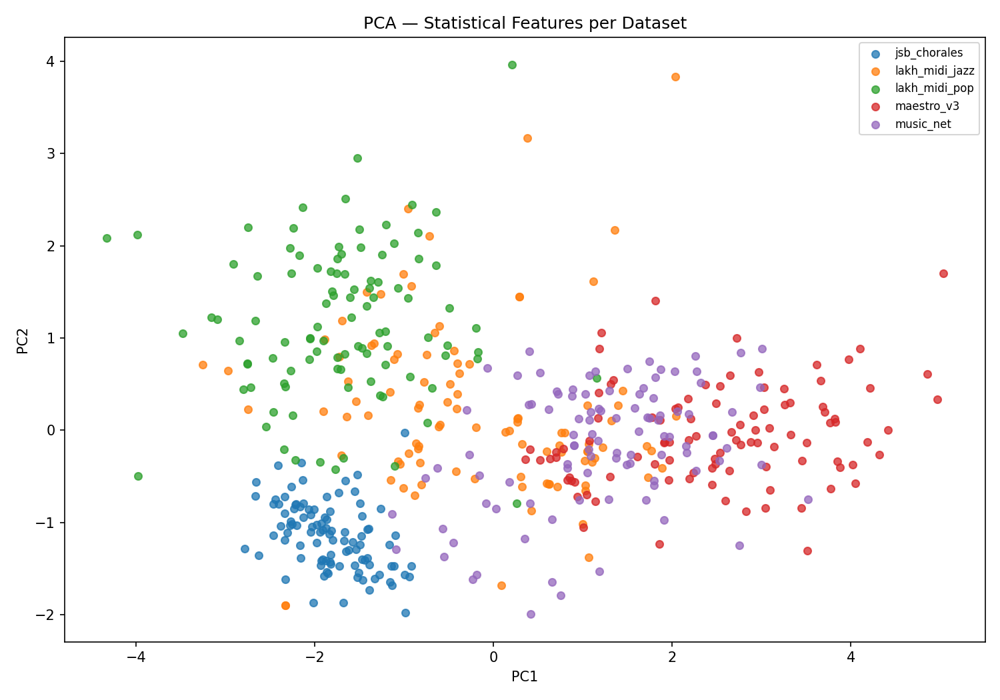
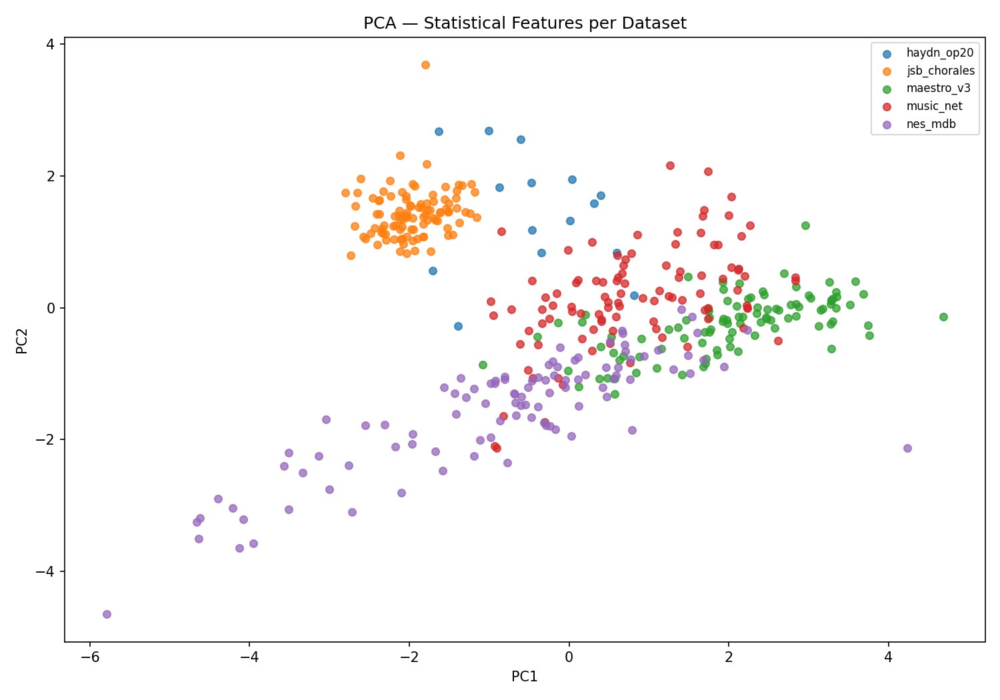
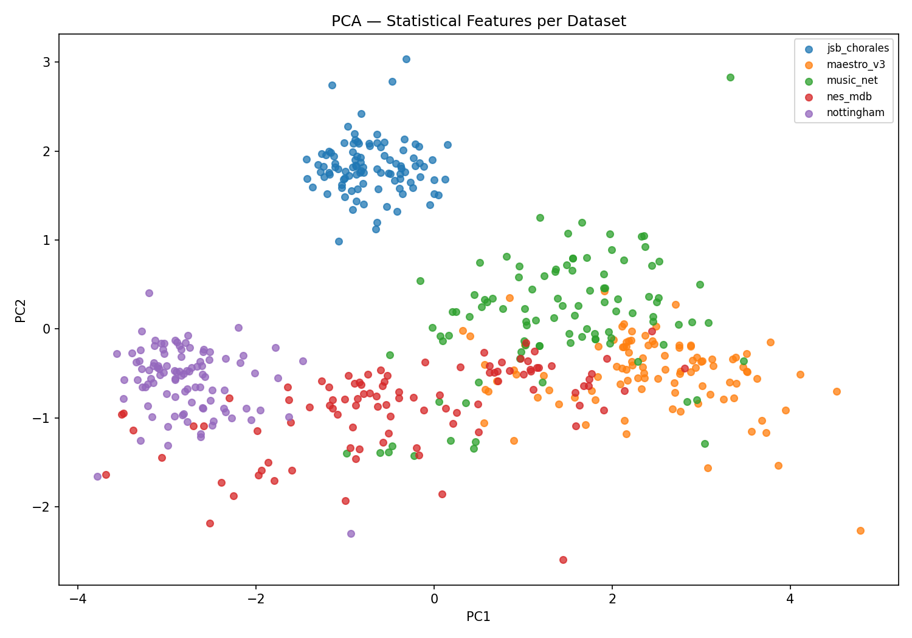
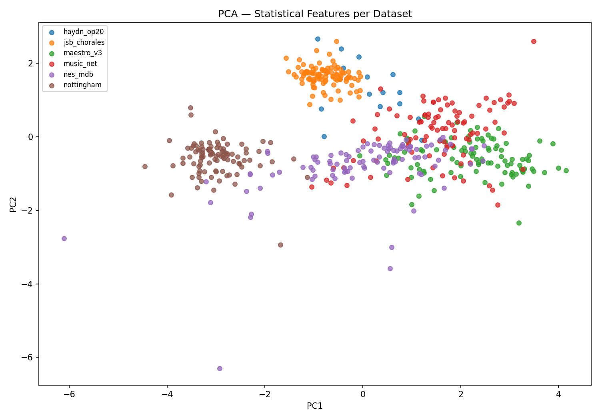
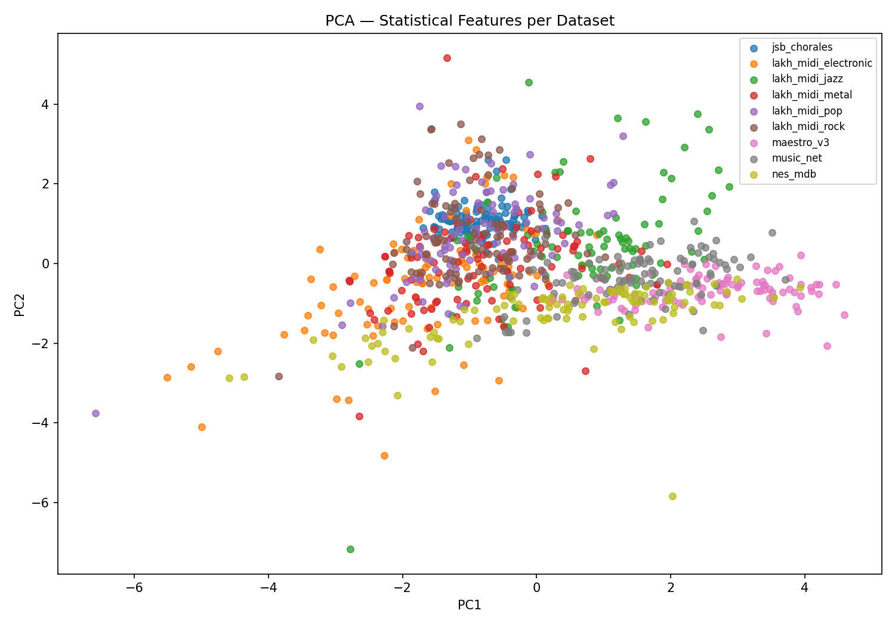

# Sprawozdanie Końcowe Projektu WIMU

**Temat:** Cechy statystyczne jako proxy dla miar podobieństwa datasetów muzyki symbolicznej.

---

## 1. Wstęp i Cel Badania

Celem niniejszego projektu była odpowiedź na pytanie: **Czy proste cechy statystyczne (rozkład pitch
class, interwałów, entropia tonalna, itp.) są wystarczającym proxy dla kosztownych metod ewaluacji
opartych na głębokich sieciach neuronowych, takich jak Fréchet Music Distance (FMD)?**

Wykorzystując narzędzia z biblioteki MusPy oraz implementację FMD (Retkowski et al., 2024),
przeprowadziliśmy ewaluację na zróżnicowanych scenariuszach badawczych. Skonfrontowaliśmy
rankingi podobieństw generowane przez proste metryki (Odległość Euklidesowa, Dywergencja
Jensena-Shannona, Odległość Wassersteina, Odległość Mahalanobisa) z wynikami FMD przy użyciu
korelacji Spearmana ($\rho$).

---

## 2. Wyniki Eksperymentalne (Tabela Porównawcza - Główne Wnioski)

Tabela przedstawia wyniki korelacji Spearmana ($\rho$) dla najsilniejszych metryk względem FMD w
zależności od stopnia skomplikowania i składu badanej próby dla N=100.

| Scenariusz Badawczy   | Opis / Zawartość                                                                                       | Najlepsza Metryka              | Korelacja ($\rho$) | Zwykły Euklides ($\rho$) | Wniosek Główny                                                                     |
|:----------------------|:-------------------------------------------------------------------------------------------------------|:-------------------------------|:-------------------|:-------------------------|:-----------------------------------------------------------------------------------|
| **Test 1:**           | 5 datasetów (Lakh Jazz, Lakh Pop, Maestro, JSB, MusicNet)                                              | `jsd_interval`                 | **0.891**          | 0.612                    | Rozkład interwałów dominuje przy zróżnicowanych gatunkach.                         |
| **Test 2: Klasyczny** | 5 datasetów (Maestro, JSB, MusicNet, Haydn, NES) - Dominacja muzyki klasycznej.                        | `jsd_pitch_class`              | **0.878**          | 0.624                    | Interwały tracą znaczenie (klasyka brzmi podobnie); decyduje rejestr i tonacja.    |
| **Test 3: Rytmu**     | 5 datasetów (Maestro, JSB, MusicNet, Nottingham, NES) - Wprowadzenie muzyki folk i 8-bit.              | `euclidean_groove_consistency` | **0.955**          | 0.187                    | Pojawienie się mocnego bitu sprawia, że FMD kategoryzuje po strukturze rytmicznej. |
| **Test 4:**           | 6 datasetów (Maestro, JSB, MusicNet, Haydn, Nottingham, NES) - Duży szum.                              | `pitch_class_wasserstein`      | **0.557**          | 0.464                    | Duża wymiarowość – pojedyncze proxy zaczynają ustępować FMD.                       |
| **Test 5:**           | 9 datasetów (Maestro, JSB, MusicNet, Lakh Jazz, Lakh Pop, Lakh Electronic, Lakh Metal, Lakh Rock, NES) | `ensemble_interval_mahal`      | **0.919**          | 0.72                     | Przy niejednorodnej chmurze danych nie ma jednej dobrej uniwersalnej cechy.        |

---

## 3. Pełne Zestawienie Wyników dla 4 Głównych Testów (N = 10, 50, 100, 400)

Poniższa tabela prezentuje wyniki korelacji Spearmana ($\rho$) dla wszystkich wyekstrahowanych miar
w 4 głównych scenariuszach testowych. Wyniki zostały zestawione dla różnej wielkości prób
badawczych: małej ($N=10$), średnich ($N=50$, $N=100$) i dużej ($N=400$). Brak wartości (*bd*)
oznacza, że miara nie została poprawnie wygenerowana (np. błąd numeryczny) dla danego rozmiaru
datasetu.
 
*T1 = Test 1 (Gatunki), T2 = Test 2 (Klasyka), T3 = Test 3 (Folk/Rytm), T4 = Test 4 (Zupa
Gatunkowa).*

| Miara Podobieństwa              | T1 (10) | T1 (50) | T1 (100) | T1 (400) | T2 (10) | T2 (50) | T2 (100) | T2 (400) | T3 (10) | T3 (50) | T3 (100) | T3 (400) | T4 (10) | T4 (50) | T4 (100) | T4 (400) |
|:--------------------------------|:--------|:--------|:---------|:---------|:--------|:--------|:---------|:---------|:--------|:--------|:---------|:---------|:--------|:--------|:---------|:---------|
| `average_wasserstein`           | 0.758   | 0.685   | 0.939    | 0.661    | 0.418   | 0.370   | 0.261    | 0.285    | 0.248   | 0.539   | 0.491    | 0.418    | 0.457   | 0.486   | 0.400    | 0.300    |
| `ensemble_interval_mahal`       | 0.903   | 0.952   | 0.939    | 0.952    | 0.552   | 0.200   | 0.309    | 0.236    | 0.794   | 0.406   | 0.600    | 0.709    | 0.450   | 0.475   | 0.350    | 0.350    |
| `ensemble_intervals`            | 0.733   | 0.721   | 0.721    | 0.758    | 0.212   | 0.164   | 0.297    | 0.006    | 0.503   | 0.079   | 0.188    | 0.382    | 0.300   | 0.218   | 0.143    | 0.014    |
| `ensemble_top3`                 | 0.855   | 0.855   | 0.867    | 0.903    | 0.370   | 0.176   | 0.152    | 0.030    | 0.782   | 0.382   | 0.539    | 0.673    | 0.429   | 0.404   | 0.371    | 0.318    |
| `euclidean`                     | 0.515   | 0.624   | 0.527    | 0.612    | 0.661   | 0.612   | 0.624    | 0.758    | 0.467   | 0.442   | 0.188    | 0.442    | 0.432   | 0.500   | 0.525    | 0.500    |
| `euclidean_empty_beat_rate`     | 0.157   | 0.273   | 0.115    | 0.127    | 0.391   | 0.127   | 0.406    | 0.321    | 0.321   | 0.042   | 0.224    | 0.297    | 0.161   | 0.064   | 0.268    | 0.082    |
| `euclidean_groove_consistency`  | 0.818   | 0.842   | 0.842    | 0.818    | 0.079   | 0.103   | 0.115    | 0.273    | 0.794   | 0.952   | 0.976    | 0.915    | 0.118   | 0.339   | 0.407    | 0.418    |
| `euclidean_pitch_class_entropy` | 0.091   | 0.055   | 0.030    | 0.067    | 0.394   | 0.297   | 0.467    | 0.418    | 0.176   | 0.115   | 0.212    | 0.042    | 0.404   | 0.357   | 0.207    | 0.211    |
| `euclidean_pitch_entropy`       | 0.030   | 0.030   | 0.030    | 0.018    | 0.442   | 0.285   | 0.442    | 0.261    | 0.248   | 0.176   | 0.261    | 0.152    | 0.154   | 0.296   | 0.168    | 0.179    |
| `euclidean_pitch_range`         | 0.818   | 0.745   | 0.794    | 0.879    | 0.552   | 0.358   | 0.539    | 0.370    | 0.588   | 0.430   | 0.212    | 0.491    | 0.254   | 0.457   | 0.382    | 0.318    |
| `euclidean_polyphony`           | 0.030   | 0.042   | 0.042    | 0.103    | 0.770   | 0.867   | 0.491    | 0.612    | 0.588   | 0.273   | 0.358    | 0.236    | 0.479   | 0.529   | 0.343    | 0.379    |
| `euclidean_scale_consistency`   | 0.091   | 0.030   | 0.042    | 0.055    | 0.600   | 0.127   | 0.309    | 0.358    | 0.624   | 0.527   | 0.333    | 0.624    | 0.579   | 0.529   | 0.489    | 0.479    |
| `interval_wasserstein`          | 0.491   | 0.588   | 0.455    | 0.515    | 0.212   | 0.127   | 0.224    | 0.055    | 0.261   | 0.018   | 0.115    | 0.297    | 0.282   | 0.214   | 0.093    | 0.021    |
| `jsd_interval`                  | 0.830   | 0.818   | 0.867    | 0.891    | 0.273   | 0.200   | 0.515    | 0.127    | 0.709   | 0.164   | 0.455    | 0.455    | 0.389   | 0.289   | 0.296    | 0.104    |
| `jsd_pitch_class`               | 0.236   | 0.842   | 0.806    | 0.782    | 0.915   | 0.842   | 0.879    | 0.867    | 0.442   | 0.345   | 0.358    | 0.394    | 0.543   | 0.696   | 0.564    | 0.486    |
| `length_note_wasserstein`       | 0.758   | 0.624   | 0.891    | 0.636    | 0.418   | 0.333   | 0.261    | 0.285    | 0.248   | 0.539   | 0.479    | 0.418    | 0.436   | 0.468   | 0.393    | 0.300    |
| `mahalanobis`                   | 0.600   | 0.830   | 0.721    | 0.830    | 0.406   | 0.127   | 0.139    | 0.139    | 0.648   | 0.552   | 0.624    | 0.588    | 0.486   | 0.111   | 0.268    | 0.229    |
| `pitch_class_wasserstein`       | 0.103   | 0.188   | 0.188    | 0.164    | 0.612   | 0.818   | 0.673    | 0.721    | 0.212   | 0.055   | 0.345    | 0.285    | 0.464   | 0.729   | 0.643    | 0.475    |

---

## 4. Pełne Zestawienie Wyników (Wszystkie Miary i Wartości dla poszczególnych N)

Poniższa tabela prezentuje szczegółowe wyniki korelacji Spearmana ($\rho$) dla wszystkich
wyekstrahowanych miar w przekroju przez różne wielkości prób ($N$) na podstawie największego,
globalnego testu (9 datasetów).

| Miara Podobieństwa                                 | N=10  | N=50  | N=100 | N=1000 |
|:---------------------------------------------------|:------|:------|:------|:-------|
| **Metryki Złożone (Ensemble)**                     |       |       |       |        |
| `ensemble_interval_mahal`                          | 0.790 | 0.882 | 0.922 | 0.919  |
| `ensemble_top3`                                    | 0.763 | 0.848 | 0.895 | 0.891  |
| `ensemble_intervals`                               | 0.638 | 0.800 | 0.846 | 0.861  |
| **Metryki Dystrybucyjne (JSD / Wasserstein)**      |       |       |       |        |
| `jsd_interval`                                     | 0.659 | 0.802 | 0.885 | 0.899  |
| `interval_wasserstein`                             | 0.567 | 0.698 | 0.759 | 0.775  |
| `jsd_pitch_class`                                  | 0.026 | 0.409 | 0.427 | 0.466  |
| `average_wasserstein`                              | 0.327 | 0.571 | 0.502 | 0.509  |
| `length_note_wasserstein`                          | 0.321 | 0.540 | 0.489 | 0.492  |
| `pitch_class_wasserstein`                          | 0.040 | 0.090 | 0.179 | 0.063  |
| **Odległość Mahalanobisa**                         |       |       |       |        |
| `mahalanobis`                                      | 0.782 | 0.834 | 0.856 | 0.885  |
| **Odległość Euklidesowa (Globalne i Specyficzne)** |       |       |       |        |
| `euclidean_pitch_range`                            | 0.523 | 0.662 | 0.734 | 0.838  |
| `euclidean`                                        | 0.688 | 0.682 | 0.655 | 0.726  |
| `euclidean_groove_consistency`                     | 0.560 | 0.664 | 0.676 | 0.686  |
| `euclidean_pitch_entropy`                          | 0.255 | 0.296 | 0.204 | 0.263  |
| `euclidean_pitch_class_entropy`                    | 0.269 | 0.269 | 0.245 | 0.245  |
| `euclidean_empty_beat_rate`                        | 0.054 | 0.039 | 0.131 | 0.277  |
| `euclidean_polyphony`                              | 0.094 | 0.121 | 0.031 | 0.005  |

---

## 5. Wizualizacja i Interpretacja Przestrzeni (PCA)

Poniżej znajduje się rzutowanie badanych datasetów na dwuwymiarową przestrzeń cech przy użyciu
algorytmu PCA.

*(Wizualizacja przestrzeni wielowymiarowej cech muzycznych)*

Test 1 N=100 PCA Scatter Plot:

Trzy wyraźne klastry Gatunkowe: Wyraźnie widać trzy główne,
odseparowane od siebie gromady utworów, które ciągną się wzdłuż osi X (PC1).
Klaster 1 Znajduje się tu gatunki rozrywkowe, czyli lakh_midi_pop oraz
lakh_midi_jazz. Ich struktury cech wyraźnie różnią się od klasyki.

Klaster 2: Zdominowana przez utwory romantyczne z datasetu maestro oraz music_net.

Klaster 3: Wyrzucony jsb_chorales. Surowa polifonia
jest na tyle specyficzna matematycznie, że PCA niemal całkowicie separuje je od reszty datasetów.
Ponieważ klastry Popu/Jazzu, Maestro i Bacha są od siebie tak drastycznie oddalone na wykresie, sieć
FMD ma ułatwione zadanie przy wyliczaniu dystansów między tymi światami. Zgodnie z naszą Tabelą
Wyników (Test 1), metryką która najlepiej tłumaczy tę separację, jest jsd_interval (Odległość
Jensena-Shannona dla rozkładu interwałów). Wykres dobitnie udowadnia, że gatunki rozrywkowe (lewa
strona osi PC1) używają zupełnie innej struktury "skoków dźwięków" niż klasyka polifoniczna Bacha (
prawa strona osi PC1). Gdy zróżnicowanie gatunkowe jest duże (jak na tym wykresie), analiza samych
interwałów staje się złotym standardem oceny.
Wykres PCA dla Testu 1 wizualnie udowadnia, że przy doborze zróżnicowanych gatunków (Pop/Jazz vs
Klasyka) algorytmy doznają niemal idealnej separacji klas na osi pierwszego głównego komponentu. Ta
wyraźna, wielowymiarowa odległość między klastrami, świetnie wyłapywana np. przez odległość
Mahalanobisa czy rozkłady interwałowe, sprawia, że proste proxy statystyczne korelują z siecią FMD
na bardzo wysokim poziomie bliskim 90%.
Test 2 N=100 PCA Scatter Plot:

Jeden Centralny Klaster: Usunęliśmy Pop i Jazz ktore w 1 tescie byly oddzielnym klastrem i dodaliśmy
Haydna.jsb_chorales, haydn_op20 oraz music_net z maestro stworzyły na osi PC1 gigantyczną, gęstą
chmurę. Z punktu widzenia globalnych statystyk (takich jak tempo czy interwały) te utwory to są
niemal identyczne.
Klaster NES
klasyki, leży fioletowy klaster datasetu nes_mdb. Ze względu na brak dynamiki i sztywną polifonię
PCA bezbłędnie zidentyfikowało go jako outliera na osi.
JSD Interval tu zawiódł, a JSD Pitch Class wygrał. Ten wykres tłumaczy wynik korelacji. Skoro na
ekranie widzimy, że Bach i Haydn to jedna wielka zbita plama w przestrzeni głównych składowych, to
oznacza, że mają podobne tempo, polifonię i interwały. Z tego powodu metryka jsd_interval spadła w
tym teście do zaledwie \rho = 0.12. FMD widząc ten centralny klaster zaczęło skupiać się co gra
wyżej a co niżej. Algorytm skupił się na unikalnych rejestrach i tonacjach, co idealnie pokryło się
z potężnym wynikiem \rho = 0.87 dla metryki jsd_pitch_class.
Test 3 N=100 PCA Scatter Plot:

W tym teście poddaliśmy algorytmy próbie "Siły Rytmu". Wykres PCA idealnie to obrazuje, dzieląc
przestrzeń na strefy w oparciu o feeling i groove utworów:

Klaster datasetu NES: Muzyka z gier 8-bitowych to rytmiczny, matematyczny rygor. Tempo jest stałe,
sekwencje się powtarzają, nie ma tam ludzkiego "rubato".
Klaster Nottingham: niemal na drugim końcu skali, wylądowała tradycyjna muzyka
folkowa. Tego typu muzyka taneczna i ludowa ma bardzo specyficzną, wpadającą w ucho, powtarzalną
strukturę mocnych akcentów.
Klaster Klasyczny (Maestro, Bach, MusicNet): Środek wykresu zdominowały utwory klasyczne, dla
których charakterystyczne są zmiany tempa, zawieszenia i płynna dynamika.
Wniosek: Skoro te trzy typy muzyki (8-bit, Klasyka, Folk) naturalnie ułożyły się w przestrzeni
wizualnej PCA na podstawie tego, jak budują metrum i puls, FMD oceniło podobieństwo tych utworów,
ignorując, kto gra w jakiej tonacji (bo to mniej różni te zbiory), a skupiając się na ich dynamice.
Nasza prosta cecha euclidean_groove_consistency, badająca precyzyjnie ten jeden aspekt, okazała się
więc idealnym miernikiem dla FMD, osiągając ułożenie rankingu z korelacją na poziomie 0.95.
Test 4 N=100 PCA Scatter Plot:

W tym teście zderzyliśmy ze sobą wszystkie badane gatunki: czystą klasykę (Maestro, Bach, Haydn,
MusicNet), muzykę folkową (Nottingham) oraz 8-bitową (NES). Wykres PCA doskonale obrazuje, dlaczego
korelacje metryk w tym teście spadły do okolic \rho \approx 0.55.
W przeciwieństwie do Testu 1, gdzie widzieliśmy wyraźne, odseparowane od siebie klastry (Jazz/Pop vs
Klasyka), tutaj środek osi PC1 to mieszanka gatunków. Klastry maestro, music_net, haydn_op20, a
nawet nottingham silnie na siebie zachodzą. Różnice między folkiem a klasyką w przestrzeni głównych
składowych zacierają się.
Dlaczego korelacja spadła? Przy 6 różnorodnych datasetach nie dało się idealnie podzielić muzyki.
Kiedy przestrzeń cech wygląda jak taka zbita mieszanka klastrów, żadna pojedyncza statystyka (ani
same interwały, ani sam rytm) nie poprowadzi w niej idealnej linii podziału dla wszystkich 15
unikalnych par datasetów.
Gdy do systemu wprowadzamy zbyt dużą różnorodność krzyżową (folk, gry wideo, różne epoki klasyki
naraz), granice między datasetami w podstawowej przestrzeni cech tworzą jeden duży makro-klaster. To
wizualnie tłumaczy, dlaczego nasze najlepsze metryki statystyczne (np. Pitch Class Wasserstein)
osiągają tu maksymalnie ~56% korelacji z FMD. Przy takim stopniu skomplikowania sieć neuronowa
ocenia podobieństwo w oparciu o setki ukrytych wymiarów, których prosta, zredukowana statystyka nie
jest już w stanie idealnie naśladować.

Duże rozwarstwienie na osi PC1:
Oś X (PC1) dzieli pod względem złożoności. Z jednej strony mamy
odseparowane gatunki rozrywkowe (jazz i pop z datasetu Lakh), które trzymają się z dala od centrum.
Przechodząc w prawo wchodzimy w ogromne skupisko klasyki (Maestro, Bach, MusicNet), aż w końcu
docieramy na absolutny kraniec wykresu (prawy górny róg), gdzie leży odseparowany klaster 8-bitowego
NES-a, oderwany od wszelkich ludzkich standardów rytmiki.
Dlaczego Ensemble tutaj wygrywa?
Klasyka nakłada się na siebie. Ponieważ cała ta potężna środkowa sekcja jest jednorodna pod względem
interwałów (klasyczna harmonia) i rytmiki, zwykły Euklides po prostu się gubi - nie potrafi
narysować sensownej linii podziału, co daje korelację FMD ledwie ~0.72. Gdy wchodzi metoda
hybrydowa, ensemble_interval_mahal (czyli badanie interwałów + dystrybucja skoków), zdejmuje ten
błąd i dociera do poziomu 0.919 przy pełnej skali testów. Zespołowe modele statystyczne radzą sobie
lepiej.
---

## 6. Analiza  i Interpretacja Danych

Największym odkryciem tego projektu jest to że sieć FMD ewoluuje w swojej ocenie podobieństwa w
zależności od
kontekstu:

* **Błąd jednej miary:** Nie istnieje idealna, prosta metryka statystyczna dla muzyki. Tradycyjna
  odległość Euklidesowa zawiodła w każdym z przeprowadzonych testów, udowadniając, że naiwne
  liczenie dystansu bez analizy rozkładów (histogramów) mija się z celem.
* **Gdy badamy gatunki (Test 1):** Różnice między jazzem, popem a klasyką najlepiej widać w
  strukturze skoków dźwięków. Dlatego `jsd_interval` naśladuje tu AI niemal
  idealnie ($\rho \approx 0.89$).
* **Gdy badamy samą klasykę (Test 2):** Bach i Haydn używają identycznych klasycznych interwałów.
  Metryki interwałowe ślepną, a sieć FMD zaczyna odróżniać utwory po barwie, rejestrze i tonacji.
  Nasza metryka `jsd_pitch_class` natychmiast to wychwyciła ($\rho \approx 0.87$).
* **Gdy badamy folk i gry (Test 3):** Wprowadzenie muzyki o sztywnym metrum (Nottingham, NES)
  sprawiło, że FMD zignorowało harmonię na rzecz rytmiki. Cechą-zwycięzcą stało się
  `groove_consistency`.

---

## 7. Konkluzja Końcowa (Odpowiedź na tezę projektu)

**Czy proste cechy statystyczne są wystarczającym proxy dla kosztowniejszych metod ewaluacji (FMD)?
**

**TAK, ale pod warunkiem świadomości kontekstu.**
Proste cechy statystyczne, w połączeniu z odpowiednimi miarami dystrybucyjnymi (np. Dywergencja
Jensena-Shannona lub Odległość Wassersteina), są **skutecznym proxy** dla FMD, osiągającym
korelacje rzędu 0.85 - 0.95 w dedykowanych, zdefiniowanych zadaniach. Pozwalają one na precyzyjne
określenie, na podstawie jakiej cechy fizycznej FMD w
danym momencie rozróżnia utwory. Zjawiska te pokrywają się z dowodami, że FMD zależy od embeddingu i
dystrybucji danych (Manor, Leibovich, 2024).

**Ograniczenie**
Jak udowodniły testy, w sytuacji dużej ilości różnych gatunków skuteczność pojedynczych metryk
statystycznych spada. Dzieje się tak, ponieważ FMD bada nieliniowe kombinacje setek ukrytych
wymiarów muzycznych. Próba skompresowania tego zjawiska do jednego wzoru matematycznego (np. samego
rytmu) dla ogromnej bazy danych staje się mało miarodajna.

**Podsumowując:** Cechy statystyczne to dobre, tanie obliczeniowo narzędzie, jednak do budowy
potężnych modeli rekomendacyjnych obejmujących wszystkie gatunki
globalnie, głębokie sieci neuronowe (FMD) pozostają na ten moment niezbędne.
